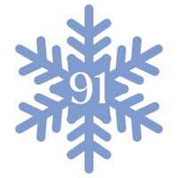

#  Winter 91 Challenge

Color scheme: <https://coolors.co/809bce-95b8d1-b8e0d2-d6eadf-d19494-ebd5d5>

Made with:
<code></code>&nbsp;
<code></code>&nbsp;
<code></code>&nbsp;
<code></code>&nbsp;
<code></code>&nbsp;
<code></code>&nbsp;

Read the [DEPS.md](DEPS.md) file for the (small) list of dependencies.

## Setup Commands
- Create a file named `.PASSKEY.txt` which contains the passkey
- Run `nix build`
- Run `./result/bin/app`
